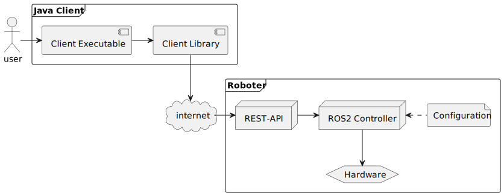

# raros
[](https://github.com/francWhite/raros/actions/workflows/ci.yaml)
[](https://github.com/francWhite/raros/blob/main/LICENSE)
[](https://central.sonatype.com/artifact/io.github.francwhite/raros-client)
[](https://github.com/francWhite/raros/pkgs/container/raros)
[](https://javadoc.io/doc/io.github.francwhite/raros-client/latest/io/github/francwhite/raros/client/controller/RobotController.html)

raros is an application consisting of different subsystems that can be used to control a physical robot.
This application was developed as part of a project at the Lucerne University of Applied Sciences and Arts with the goal
of evaluating how such a control system can be implemented with ROS2. 

Ultimately, the project should be able to be used to teach students the basic concepts of programming in a playful way, 
as they can see their work directly resulting in actions executed by the robot instead of just viewing some text in a terminal.

## Table of contents
- [Architecture](#architecture)
- [Installation](#installation)
  - [Client-Library](#client_library_install)
  - [Controller](#controller_install)
  - [Microcontroller](#microcontroller_install)
- [Usage](#usage)
  - [Client-Library](#client_library_usage) 
- [Development](#development)
  - [Prerequisites](#prerequisites)
  - [Build](#build)
  - [Run](#run)
- [License](#license)


## Architecture


## Installation
<a name="client_library_install"></a>
### Client-Library
The client library is available on [Maven Central](https://search.maven.org/artifact/io.github.francwhite/raros-client) and can be referenced in your project as follows:

Maven:
```xml
<dependency>
    <groupId>io.github.francwhite</groupId>
    <artifactId>raros-client</artifactId>
    <version>1.0.5</version>
</dependency>
```

Gradle:
```groovy
implementation 'io.github.francwhite:raros-client:1.0.5'
```

<a name="controller_install"></a>
### Controller
All required subsystems for the master controller (RaspberryPi) are available as docker images on [GitHub Container Registry](https://github.com/francWhite?tab=packages&repo_name=raros).
The easiest way to get started is to use the [docker-compose.yml](https://github.com/francWhite/raros/blob/main/docker-compose.yaml) 
file in the root directory of this repository.

**Prerequisites**:
- [docker](https://docs.docker.com/engine/install/) is installed
- `./config` directory exists for the volume mount

**Instructions**:
```shell
cd [path/to/docker-compose.yaml]    # change directory to where the docker-compose.yaml file is located
mkdir config                        # create config directory, only required on first run
docker-compose up -d                # start the containers in detached mode
```

<a name="microcontroller_install"></a>
### Microcontroller
The code for the microcontroller (arduino) is available in the [micro_ros](https://github.com/francWhite/raros/tree/main/apps/micro_ros)
directory of this repository. To build and flash the software onto the microcontroller, clone the repository and use the `flash.sh` script located in root of said directory.

**Prerequisites**:
- [PlatformIO CLI](https://docs.platformio.org/en/stable/core/installation/index.html) is installed
- Arduino is connected to the computer via USB

**Instructions**:
```shell
git clone https://github.com/francWhite/raros.git   # clone the repository
cd raros/apps/micro_ros                             # navigate to the micro_ros directory
chmod +x flash.sh                                   # make the script executable
./flash.sh                                          # build and flash the software onto the microcontroller
```

## Usage

<a name="client_library_usage"></a>
### Client-Library
Make sure that the controller and microcontroller are running and connected to the same network as the client.
The client library can be used to control the robot over the `RobotController` interface. An instance of the controller can be created as follows:

```java
import io.github.francwhite.raros.client.controller.RobotControllerFactory;
...
RobotController client = RobotControllerFactory.create(URI.create("http://hostname:8000"))
```

## License
This project is licensed under the MIT License - see the [LICENSE](LICENSE) file for details.
